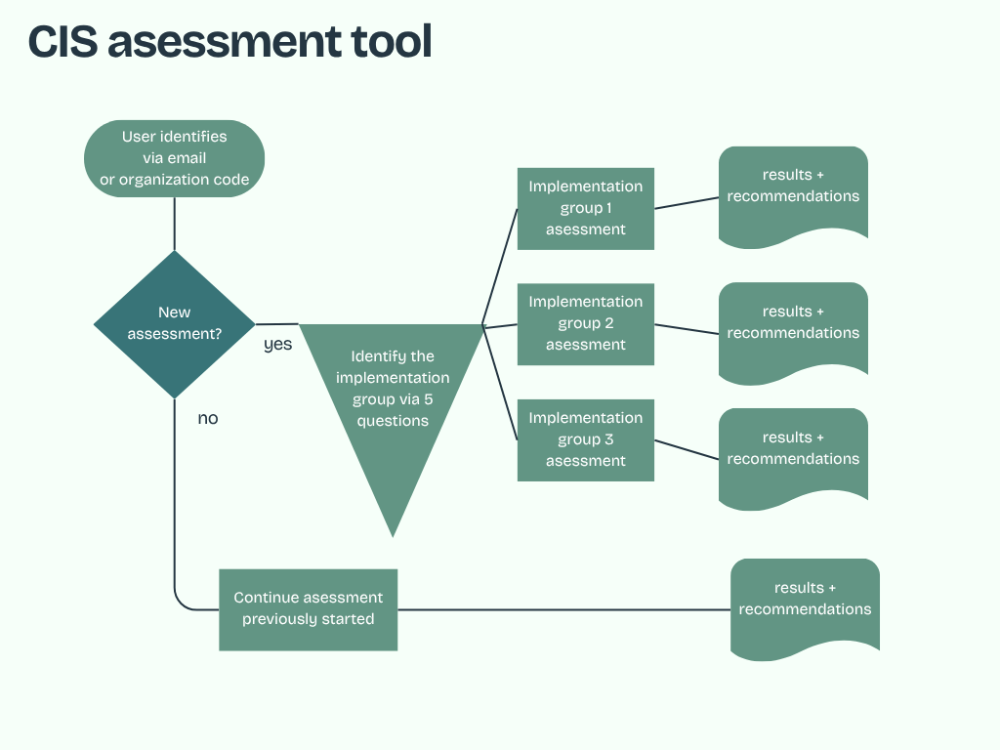

# CIS RAM v2.1 Risk Assessment Tool

A full-featured, non-technical-user-friendly web application implementing the **CIS Risk Assessment Method (RAM) v2.1**, aligned with **CIS Controls v8.1**. Built for multi-tenant organizations to conduct structured cybersecurity risk assessments and generate executive-ready reports.



---

## Features

### Assessment Engine
- **CIS Controls v8.1** — All 153 safeguards implemented across IG1, IG2, and IG3
- **Implementation Group Screening** — 5-question wizard automatically determines IG1 / IG2 / IG3
- **Plain-English Interface** — Every safeguard, question, and score option is written for non-technical users
- **CIS RAM v2.1 Risk Scoring** — Faithful implementation of the official methodology:
  - IG1: 3-point scales, VCDB-based expectancy lookup, maturity-driven scoring
  - IG2/3: 5-point scales, direct expectancy scoring, financial impact dimension
  - Risk Score = Expectancy × MAX(Mission, Operational, Obligations [, Financial])
  - ORI (Organizational Risk Index) = (Σ scores) / (count × max) × 100

### User Experience
- **Risk Score Explanation Panel** — Expandable panel on every safeguard showing "What This Score Means", "Required Action", and "Effect on Your Organization"
- **"What Does This Mean?"** — Collapsible info box per safeguard with plain-English description and why it matters
- **Friendly Impact Labels** — e.g. "Minor inconvenience", "Significant recovery needed", "Could destroy us"
- **Friendly Maturity Labels** — e.g. "Not in place", "Partially done", "Fully in place", "Tested & verified", "Automated & assured"
- **Live progress tracking** across all safeguards

### Report
- **Organizational Risk Index (ORI)** — Gauge chart with risk level classification
- **Control Scores** — Per-control breakdown with bar charts
- **Immediate Actions** — High-priority items requiring urgent attention
- **Recommendations** — Short-term and long-term improvement roadmap per safeguard
- **Safeguard Status Tab** — Full list of all assessed safeguards with compliance status (Compliant / Needs Improvement / Non-Compliant / Critical), expandable details, search, and filter
- **Branding** — Organization logo shown in report header (configurable in Admin Settings)
- **PDF Export** — Full executive report export via jsPDF including all safeguards table

### Admin Console (`/admin`)
- **Dashboard** — Assessment statistics and organization overview
- **Organizations** — Create and manage multi-tenant organizations (unique org codes)
- **Assessments** — View all assessments with status, IG level, ORI, and PDF download
- **Users** — Add, edit roles, and delete users per organization
- **Settings** — Branding (logo URL, org name, primary color), disclaimer configuration

### Multi-Tenant & Session Architecture
- Each organization has a unique **access code** (e.g. `DEMO001`)
- Users identify by email + org code — no account creation required
- Each assessment has a unique **session ID** (UUID in URL + localStorage) preventing response mixing
- Admin area protected by Supabase email/password auth

### Demo Mode
Runs fully offline without Supabase credentials using an in-memory data store:
- Admin login: `admin@demo.com` / `demo1234`
- Org codes: `DEMO001`, `ACME001`

---

## Tech Stack

| Layer | Technology |
|-------|-----------|
| Frontend | React 18 + Vite 5 |
| Styling | Tailwind CSS v3 |
| State Management | Zustand |
| Routing | React Router v6 |
| Charts | Recharts |
| PDF Export | jsPDF + jspdf-autotable |
| Icons | Lucide React |
| Backend/Auth | Supabase (PostgreSQL + Row Level Security) |
| Utilities | clsx |

---

## Getting Started

### Prerequisites
- Node.js 18+ and npm

### Installation

```bash
git clone https://github.com/YOUR_USERNAME/cis-assessment-tool.git
cd cis-assessment-tool
npm install
```

### Run in Demo Mode (no Supabase required)

```bash
npm run dev
```

Open `http://localhost:5173`. The app runs fully in-memory with demo data.

### Connect Real Supabase

1. Create a project at [supabase.com](https://supabase.com)
2. Run `supabase/schema.sql` in the Supabase SQL Editor
3. Create a `.env` file in the project root:

```env
VITE_SUPABASE_URL=https://your-project.supabase.co
VITE_SUPABASE_ANON_KEY=your-anon-key
```

4. Restart the dev server
5. Create your first admin user via Supabase Auth dashboard
6. In the `profiles` table, set `role = 'admin'` for that user

---

## Application Flow

```
Home (email + org code)
  └── Screening (5 questions → IG1/IG2/IG3)
        └── Assessment (56/130/153 safeguards)
              └── Report (ORI gauge, control scores, safeguard status, PDF export)

/admin/login
  └── Admin Console
        ├── Dashboard
        ├── Organizations
        ├── Assessments (+ PDF download)
        ├── Users
        └── Settings (branding, disclaimer)
```

---

## Project Structure

```
src/
├── lib/
│   ├── safeguards.js        # All 153 CIS Controls v8.1 safeguards + VCDB lookup
│   ├── calculations.js      # CIS RAM risk math (ORI, expectancy, risk scores)
│   ├── recommendations.js   # Per-safeguard immediate/short/long-term actions
│   ├── settings.js          # Branding settings (localStorage)
│   └── supabase.js          # Supabase client + full demo/offline mode
├── stores/
│   └── assessmentStore.js   # Zustand global state
├── pages/
│   ├── Home.jsx             # Email + org code entry
│   ├── Screening.jsx        # IG determination questionnaire
│   ├── Assessment.jsx       # Safeguard-by-safeguard assessment
│   ├── Report.jsx           # Executive report + PDF export
│   └── admin/
│       ├── Login.jsx
│       ├── Dashboard.jsx
│       ├── Organizations.jsx
│       ├── AssessmentsList.jsx
│       ├── Users.jsx
│       └── Settings.jsx
├── components/
│   ├── AdminLayout.jsx
│   ├── Layout.jsx
│   ├── assessment/
│   │   ├── MaturitySelector.jsx
│   │   ├── ImpactSelector.jsx
│   │   └── ProgressBar.jsx
│   └── report/
│       ├── RiskGauge.jsx
│       ├── ControlScores.jsx
│       └── RecommendationsPanel.jsx
supabase/
└── schema.sql               # Full DB schema with RLS policies
```

---

## CIS RAM v2.1 Scoring Reference

### IG1 (56 safeguards)
- Maturity Score: 1–5 → auto-maps to VCDB Expectancy (1–3)
- Impact dimensions: Mission, Operational, Obligations (scale 1–3)
- Max score per safeguard: **9**

### IG2 (130 safeguards)
- Expectancy: directly assessed 1–5
- Impact dimensions: Mission, Operational, Obligations (scale 1–5)
- Max score per safeguard: **25**

### IG3 (153 safeguards)
- Same as IG2 + Financial impact dimension (1–5)
- Max score per safeguard: **25**

### ORI Levels
| ORI | Level | Meaning |
|-----|-------|---------|
| 0–20 | Low | Strong security posture |
| 21–40 | Guarded | Generally adequate with some gaps |
| 41–60 | Elevated | Notable risk requiring attention |
| 61–80 | High | Significant risk requiring prompt action |
| 81–100 | Critical | Immediate remediation required |

---

## License

MIT
